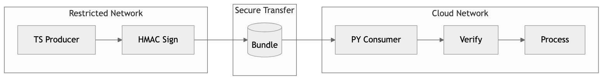

# Hybrid Connectivity Bridge



[](https://github.com/cmangun/hybrid-connectivity-bridge/actions/workflows/ci.yml)
[]()
[]()
[]()

Secure bridge pattern for hybrid connectivity between restricted networks and cloud.

---

## 🚀 Run in 60 Seconds

```bash
git clone https://github.com/cmangun/hybrid-connectivity-bridge.git
cd hybrid-connectivity-bridge
make demo
```

**Expected output:**
```
[Producer] Creating bundle: bundle_001.json
[Producer] Signature: hmac_sha256:a3b2c1...
[Consumer] Validating bundle_001.json
[Consumer] ✅ Signature valid
[Consumer] ✅ Checksum verified
[Consumer] Processing complete
```

---

## 📊 Customer Value

This pattern typically delivers:
- **Secure data transfer** across air-gapped networks
- **100% integrity verification** (HMAC + SHA-256)
- **Complete audit trail** for compliance requirements

---

## Architecture

```
┌─────────────────────────────────────────────────────────────┐
│                  RESTRICTED NETWORK                          │
│  ┌──────────────────────────────────────────────────────┐   │
│  │                TypeScript Producer                    │   │
│  │  ┌──────────┐  ┌──────────┐  ┌──────────────────┐   │   │
│  │  │  Data    │─▶│  Sign    │─▶│  Write Bundle    │   │   │
│  │  │  Source  │  │  (HMAC)  │  │  (staging/)      │   │   │
│  │  └──────────┘  └──────────┘  └──────────────────┘   │   │
│  └──────────────────────────────────────────────────────┘   │
└─────────────────────────────────────────────────────────────┘
                           │
                    [ Secure Transfer ]
                    [ USB / SFTP / S3 ]
                           │
                           ▼
┌─────────────────────────────────────────────────────────────┐
│                     CLOUD NETWORK                            │
│  ┌──────────────────────────────────────────────────────┐   │
│  │                 Python Consumer                       │   │
│  │  ┌──────────┐  ┌──────────┐  ┌──────────────────┐   │   │
│  │  │  Read    │─▶│  Verify  │─▶│    Process       │   │   │
│  │  │  Bundle  │  │  (HMAC)  │  │    & Audit       │   │   │
│  │  └──────────┘  └──────────┘  └──────────────────┘   │   │
│  └──────────────────────────────────────────────────────┘   │
└─────────────────────────────────────────────────────────────┘
```

---

## Security Features

| Feature | Implementation |
|---------|----------------|
| Signatures | HMAC-SHA256 on payload |
| Integrity | SHA-256 checksum |
| Schema | JSON Schema validation |
| Audit | Timestamped processing log |

---

## Bundle Format

```json
{
  "id": "bundle_001",
  "timestamp": "2024-01-15T10:30:00Z",
  "signature": "hmac_sha256:...",
  "checksum": "sha256:...",
  "payload": { "data": [...] }
}
```

---

## Next Iterations

- [ ] Add encryption at rest (AES-256)
- [ ] Add S3/Azure Blob connectors
- [ ] Add retry with dead-letter queue
- [ ] Add compression for large payloads
- [ ] Add schema versioning

---

## License

MIT © Christopher Mangun

**Portfolio**: [field-deployed-engineer.vercel.app](https://field-deployed-engineer.vercel.app/)
